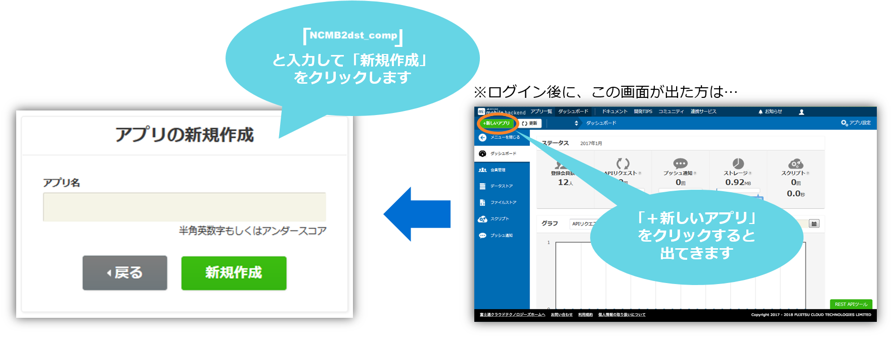

# NCMB2dst_comp

## 概要
本プロジェクトはUnityの[2D Shooting Game](https://github.com/unity3d-jp-tutorials/2d-shooting-game/wiki)に　オンラインランキング・ゴースト機能を追加したデモを楽しめるものです。
サーバーには[ニフクラ mobile backend](https://mbaas.nifcloud.com)を利用します。

詳細資料は下記↓

http://www.slideshare.net/fumisatokawahara/unity-58145478

## ニフクラmobile backendって何？？
スマートフォンアプリのバックエンド機能（プッシュ通知・データストア・会員管理・ファイルストア・SNS連携・位置情報検索・スクリプト）が**開発不要**、しかも基本**無料**(注1)で使えるクラウドサービス！今回はデータストアを体験します

注1：詳しくは[こちら](https://mbaas.nifcloud.com/function.htm)をご覧ください


## 動作確認環境

* Unity 2020.1.8f1での動作を確認しています

## 手順
### 1. [ニフクラmobile backend](https://mbaas.nifcloud.com/)の会員登録とログイン→アプリ作成

* 上記リンクから会員登録（無料）をします。登録ができたらログインをすると下図のように「アプリの新規作成」画面が出るのでアプリを作成します



* アプリ作成されると下図のような画面になります
* この２種類のAPIキー（アプリケーションキーとクライアントキー）は次のステップで使用します。 


### 2. GitHubからサンプルプロジェクトの<a href="https://github.com/NIFCloud-mbaas/NCMB2dst_comp/archive/master.zip">ダウンロード</a>

* 上記のリンクをクリックして、プロジェクトをダウンロード下さい。

### 3. Unityでアプリを起動

* ダウンロードしたフォルダを解凍し、Unityから開いてください。その後、stageシーンを開いてください。

### 4. APIキーの設定

* stageシーンの`NCMBSettings`を編集します
* 先程[ニフクラmobile backend](https://mbaas.nifcloud.com/)のダッシュボード上で確認したAPIキーを貼り付けます


* 貼り付けたらシーンを保存して下さい。

### 5. 動作確認

##### iOS端末へのビルド

* iOSビルド手順は以下のとおりです。  
iOS端末でビルドを行うには、Unityで.xcodeprojファイルを作成します。
- 「Build Settings」へ戻り、Platformで「iOS」を選択 -> 「Switch Platform」をクリックします。


- ボタンが「Build」に変わったらクリックします。アプリ名を入力するとビルドが開始されるので、完了したらXcodeで開いてください。

- XcodeでPush Notificationの追加とプロビジョニングファイルの設定を行う必要があります。[iOSのドキュメント](/doc/current/push/basic_usage_ios.html)の「5.1 Xcodeでの対応」を実装してください。


###### Xcodeの追加設定

  * iOSであり、Unity SDK v4.0.4以上の場合、Xcode側にて「WebKit.framework」「UserNotifications.framework」を追加する必要があります。
  * Xcodeで「Unity-iPhone」-> General -> TARGETで「UnityFramework」を選択します。追加されているライブラリ一覧の下にある「＋」をクリックします。
  
  * 検索窓にて「Web」と入力し、「WebKit.framework」があるので選択しAddをクリックします。


* 「UserNotifications.framework」ライブラリも同じように検索して追加します


ライブラリ一覧に追加されていることが確認できれば設定完了です。

※注意１: Unity SDK v4.2.0以上を使用している場合、上の２つに加えて「AuthencationServices.framework」も追加する必要があります。


* 「Build Phases」 タブで「AuthenticationServices.framework」を「Optional」にします。  


※注意２： Unity 2019.3未満の場合は、以下の画像のように TARGET->「Unity-iPhone」でフレームワークを追加するようにしてください。
こちらも「WebKit.framework」「UserNotifications.framework」「AuthenticationServices.framework」を追加する必要があります。


- 上記が完了しましたら、iOS動作確認は可能となります。

* Unity画面で上部真ん中の実行ボタン（さんかくの再生マーク）をクリックしして、ゲームを体験しましょう！


<br/>

#### スコア保存

#### スコア保存のコード説明

スコア保存のコードはAsset>Scriptsの「SaveScore.cs」にて行っています。
下記のコードが、スコア保存に関するコードになります、ご参照ください。

```csharp
//mobile backendのSDKを読み込む
using NCMB;
using UnityEngine;
using System.Collections;
using System.Collections.Generic;

public class SaveScore: MonoBehaviour {
	// mobile backendに接続---------------------
	public void save(string name, int score) {
		//データストアにスコアクラスを定義
		//あらかじめ定義していない場合は自動で作成される
		NCMBObject obj = new NCMBObject("Score");

		//obj["name"]でKeyを　= nameでvalueを設定
		obj["name"] = name;

		//obj["score"]でKeyを　= scoreでvalueを設定
		obj["score"] = score;

		//obj["Log"]でKeyを　= Player.posListでvalueを設定
		//走行ログの取得方法は後述
		obj["Log"] = Player.posList;

		//この処理でサーバーに書き込む
		obj.SaveAsync();
	}
}
```

#### 走行ログについて

走行ログはゲームプレイ中にPlayerの座標を取得・配列化しておき、スコア保存時にサーバーに一緒に保存しています。
コードとしてはAsset>Scriptsの「Player.cs」にて行っています。
下記のコードをご参照ください。

```csharp
public class Player: MonoBehaviour {
	// 配列を定義しておく
	public static List < float[] > posList = new List < float[] > ();

	/* 省略 */

	// 機体の移動
	void Move(Vector2 direction) {

		/* 省略 */

		//---ゴーストをつくるため、ポジションをリスト化する-----
		float[] postion = new float[2];
		postion[0] = transform.position.x;
		postion[1] = transform.position.y;
		posList.Add(postion);
		//----------------------------------------------
	}

	/* 省略 */

}
```

#### オンラインランキングの表示

#### 構成要素説明

ランキングはAsset>Scenesの「 LeaderBoard 」 シーンで生成されています。
下記にその構成要素と各役割を記します。

LeaderBoardシーンには以下のスクリプトが含まれています。

- LeaderBoard.cs
  - mobile backendと接続してスコアと名前を引き出す
- LeaderBoardManager.cs
  - ランキングの表示部、LeadeBoard.csを呼び
  - スコアと名前を引き出しランキングを描画
- Rankers.cs
  - 引き出したスコアと名前を一時的に保存するもの
  - スクリプト以外のものは以下になります。
- 各種見出しGUITextオブジェクト
  - 順位とプレイヤー名、スコアを表示するGUITextオブジェクト

## ロジック説明

ニフクラ mobile backendから子スコアのデータを取得するロジックは
Asset>Scripts 「LeaderBoard.cs」に記載されています。

```csharp
// データストアの「Score」クラスから検索
NCMBQuery < NCMBObject > query = new NCMBQuery < NCMBObject > ("Score");

//「Score」クラスの「score」カラムを降順に並び替え
query.OrderByDescending("score");

//上位5個のみ取得
query.Limit = 5;

//実際に取得
query.FindAsync((List < NCMBObject > objList, NCMBException e) = >{
	//非同期の処理
	if (e != null) {
		//検索失敗時の処理
	} else {
		//検索成功時の処理
		List < NCMB.Rankers > list = new List < NCMB.Rankers > ();

		// 取得したレコードをscoreクラスとして保存
		foreach(NCMBObject obj in objList) {

			//引き出したオブジェクトからscoreだけを取り出す
			int s = System.Convert.ToInt32(obj["score"]);

			//引き出したオブジェクトからnameだけを取り出す
			string n = System.Convert.ToString(obj["name"]);

			list.Add(new Rankers(s, n));
		}
		topRankers = list;
	}
});
```
## ゴーストの表示

ゴースト機能は主に下記の2つからできています

- ニフクラmobile backendから1位の"Log"を引っ張る
- "Log"をつかってGameObjectを操作する

### "Log"を引き出す

"Log"を引出すコードはSatgeシーンを起動した際に呼び出すBg_ghost.csに実装しています。

```csharp
using NCMB; //mobile backendのSDKを読み込む
/* 省略 */

public class Bg_ghost: MonoBehaviour {
	public static NCMBObject posObj;
	public static bool readyGhost = false;

	void Start() {
		// データストアの「Score」クラスから検索
		NCMBQuery < NCMBObject > query = new NCMBQuery < NCMBObject > ("Score");

		//「Score」クラスの「score」カラムを降順に並び替え
		query.OrderByDescending("score");

		//上位1個のみ取得
		query.Limit = 1;

		//実際に取得
		query.FindAsync((List < NCMBObject > objList, NCMBException e) = >{

			if (e != null) {
				//検索失敗時の処理
			} else {
				//検索成功時の処理
				//取得したレコードをscoreクラスとして保存
				if (objList.Count > 0) {
					Debug.Log("GhostData");
					readyGhost = true;
					foreach(NCMBObject obj in objList) {
						posObj = obj;
					}
				}
			}
		});
	}
}
```

### "Log"を使いGameObjectを操作する

GhostのGameObjectにはGhost.csというスクリプトがアタッチされており、そこで"Log"をつかってGameObjectを操作するコードが書かれています。

```csharp
using NCMB; //mobile backendのSDKを読み込む
/* 省略 */

public class Ghost: MonoBehaviour {

	/* 省略 */

	//---Bg_ghost.csで取得したゴーストデータを利用し、ゴーストを操作する
	void Update() {
		if (flameCount < limit) {
			//Bg_ghostの取得データから"Log"データをとりだし、x座標y座標成分に分ける
			float x = (float) System.Convert.ToDouble(((ArrayList)((ArrayList) Bg_ghost.posObj["Log"])[flameCount])[0]);
			float y = (float) System.Convert.ToDouble(((ArrayList)((ArrayList) Bg_ghost.posObj["Log"])[flameCount])[1]);
			//x,y座標に移動させる
			transform.position = new Vector2(x, y);
			flameCount++;
		} else {
			//"Log"がなくなればGameObjectを削除
			Destroy(this.gameObject);
		}
	}
	//------------------------------------------------------------------
}
```
